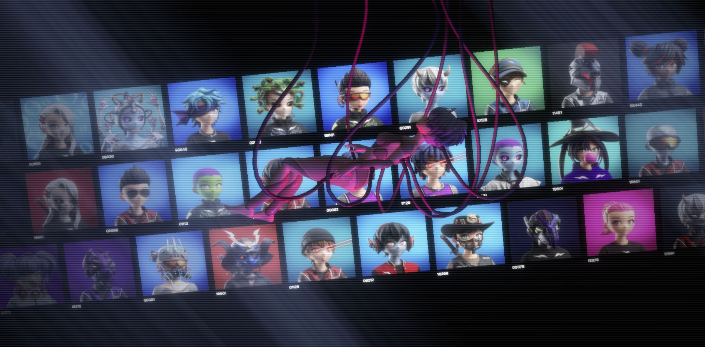

<a name="readme-top"></a>

[![LinkedIn][linkedin-shield]][linkedin-url]

<br />
<div align="center">
  <a href="https://clonex-explorer.vercel.app/">
    
  </a>

  <p align="center">
    CloneX Subgraph: Insights Made Easy
    <br />
    <br />
    <a href="https://clonex-explorer.vercel.app/">View Site</a>
    ·
    <a href="https://rtfkt.com/">Project</a>
    ·
    <a href="https://discord.gg/rtfkt">Discord</a>
  </p>
</div>

<details>
  <summary>Table of Contents</summary>
  <ol>
    <li>
      <a href="#about-the-project">About The Project</a>
      <ul>
        <li><a href="#built-with">Built With</a></li>
      </ul>
    </li>
    <li>
      <a href="#getting-started">Getting Started</a>
      <ul>
        <li><a href="#prerequisites">Prerequisites</a></li>
        <li><a href="#installation">Installation</a></li>
      </ul>
    </li>
    <li><a href="#usage">Usage</a></li>
    <li><a href="#roadmap">Roadmap</a></li>
    <li><a href="#license">License</a></li>
    <li><a href="#contact">Contact</a></li>
    <li><a href="#links">Links</a></li>
  </ol>
</details>

## About The Project

[![Product Name Screen Shot][figma-screenshot]](/assets/images/product_image.png)

For a detailed view of the design, visit the [Figma project](https://www.figma.com/file/bL1mN9OJdwcRUPCVwtXRi6/Clone-Asset-Explorer?type=design&node-id=194%3A130&mode=design&t=AoqYcLsU2gA7ElgX-1).


The CloneX subgraph indexes blockchain data for the CloneX NFT collection, a collaboration between RTFKT and Takashi Murakami, featuring 20,000 next-gen Avatars. This ambitious project marks the beginning of a comprehensive ecosystem designed for our community. Focused on quality and sophistication, these high-end avatars are meticulously crafted, ready to make their mark in the metaverse.

### Built With
**The Graph:** Utilizing both `@graphprotocol/graph-cli` and `@graphprotocol/graph-ts` for creating, building, and deploying subgraphs to interact with blockchain data efficiently.

**Google Cloud Storage:** Integrated via `@google-cloud/storage` for scalable and secure object storage.

**Sharp:** A powerful Node.js module sharp for image processing to manage media within the subgraph.

**AssemblyScript:** Leveraged for smart contract development, as indicated by the dependency on matchstick-as for testing AssemblyScript mappings.

**Docker:** Used for local development and testing, facilitating an environment where subgraphs can be deployed and removed with ease.

**Node.js:** The runtime environment enabling the execution of your project's code, scripts, and dependencies.

<p align="right">(<a href="#readme-top">back to top</a>)</p>

## Getting Started

To set up this project locally and explore the CloneX subgraph, follow these steps.

### Prerequisites

Ensure you have either Node.js or Bun installed on your system to manage project dependencies and run the development server.

- For Node.js, download and install it from [nodejs.org](https://nodejs.org/).
- For Bun, you can install it by running the following in your terminal (visit [bun.sh](https://bun.sh/) for more details):

```sh
curl https://bun.sh/install | bash
```

## Installation

1. Clone the repository to get a local copy of the project:

```sh
git clone https://github.com/vinnyhoward/loot-chest.git
cd loot-chest
```

2. Install dependencies using either npm (Node.js) or Bun. Choose the command based on your preference:

Using npm:

```sh
npm install
```

Using Bun:

```sh
bun install
```

3. Set up your environment variables:

Create a .env file in the root of the project and fill it with your Alchemy API key. You can get an API key by creating an account on [alchemy.com](https://www.alchemy.com/).

```sh
ALCHEMY_API_KEY=your_api_key_here
```
Replace your_api_key_here with your actual Alchemy API key.

4. Compile the subgraph:

```sh
npm run codegen
npm run build
```

5. Deploy the subgraph to your local node:

```sh
npm run create-local
npm run deploy-local
```

6. For deploying your subgraph to the hosted service:

```sh
npm run deploy --node https://api.studio.thegraph.com/deploy/ clonexsubgraph
```

Make sure to replace `clonexsubgraph` with your subgraph name on The Graph's hosted service.


<p align="right">(<a href="#readme-top">back to top</a>)</p>

## Usage

This subgraph provides comprehensive access to data from the CloneX NFT collection. It is designed for various stakeholders in the NFT space, including developers, data analysts, collectors, and enthusiasts. Here are some of the possible key use cases:

- **Market Analysis**: Developers and analysts can leverage the subgraph to extract insights into market trends, such as price movements, popular traits, and sales volume over time. This can help in forecasting future trends and making informed investment decisions.

- **Portfolio Tracking**: Collectors and investors can use the subgraph to track the performance of their CloneX holdings. This includes monitoring the value of individual NFTs, historical transaction data, and overall portfolio value against the market.

- **Integration with NFT Platforms**: Platforms focusing on NFT analytics, trading, and showcasing can integrate this subgraph to provide enriched content to their users. This includes detailed information about each CloneX NFT, such as its metadata, ownership history, and current market status.

- **Research and Reporting**: Academics and market researchers can utilize the subgraph for comprehensive data analysis, contributing to reports, studies, and insights into the NFT market dynamics, specifically focusing on the CloneX collection.

- **Community Engagement**: Community managers and content creators can use the subgraph to generate interesting content for social media, forums, and newsletters. This can include highlighting rare finds, significant sales, and trending NFTs within the CloneX collection.

- **Event Tracking**: Users can track significant events in the lifecycle of CloneX NFTs, such as minting, sales, transfers, and listings. This is crucial for those looking to capture market momentum or understand the impact of specific events on the NFT market.

- **Custom App Development**: With the data available through this subgraph, developers can build custom applications tailored to the needs of the NFT community. This could range from investment tools and advisory services to interactive galleries and virtual exhibitions.

By providing easy access to detailed data on the CloneX collection, this subgraph empowers users to explore, analyze, and innovate in the NFT space. Whether you're developing a new application, analyzing market trends, or simply curious about your NFT portfolio's performance, this subgraph offers the tools you need to dive deep into the CloneX ecosystem. A list of complete example queries you can make can be found here: [Queries.md](Queries.md) 

<p align="right">(<a href="#readme-top">back to top</a>)</p>

## Roadmap

- [ ] Query token metadata 

- [ ] Query sales for the last 30 days

<p align="right">(<a href="#readme-top">back to top</a>)</p>

## License

Distributed under the MIT License. See `LICENSE.txt` for more information.

<p align="right">(<a href="#readme-top">back to top</a>)</p>

## Contact

Vincent Howard - [@NiftyDeveloper](https://twitter.com/NiftyDeveloper) - vincenguyenhoward@gmail.com

Project Link: [https://github.com/vinnyhoward/loot-chest](https://github.com/vinnyhoward/clonex-subgraph)

<p align="right">(<a href="#readme-top">back to top</a>)</p>

## Links
- Project: https://rtfkt.com
- Token URI: https://clonex-assets.rtfkt.com/
- Contract Address: `0x49cF6f5d44E70224e2E23fDcdd2C053F30aDA28B`


[contributors-shield]: https://img.shields.io/github/contributors/othneildrew/Best-README-Template.svg?style=for-the-badge
[contributors-url]: https://github.com/othneildrew/Best-README-Template/graphs/contributors
[forks-shield]: https://img.shields.io/github/forks/othneildrew/Best-README-Template.svg?style=for-the-badge
[forks-url]: https://github.com/othneildrew/Best-README-Template/network/members
[stars-shield]: https://img.shields.io/github/stars/othneildrew/Best-README-Template.svg?style=for-the-badge
[stars-url]: https://github.com/othneildrew/Best-README-Template/stargazers
[issues-shield]: https://img.shields.io/github/issues/othneildrew/Best-README-Template.svg?style=for-the-badge
[issues-url]: https://github.com/othneildrew/Best-README-Template/issues
[license-shield]: https://img.shields.io/github/license/othneildrew/Best-README-Template.svg?style=for-the-badge
[license-url]: https://github.com/othneildrew/Best-README-Template/blob/master/LICENSE.txt
[linkedin-shield]: https://img.shields.io/badge/-LinkedIn-black.svg?style=for-the-badge&logo=linkedin&colorB=555
[linkedin-url]: https://www.linkedin.com/in/vinnyhoward/
[product-screenshot]: public/images/product_image.png
[figma-screenshot]: assets/images/product_image.png
[Next.js]: https://img.shields.io/badge/next.js-000000?style=for-the-badge&logo=nextdotjs&logoColor=white
[Next-url]: https://nextjs.org/
[React.js]: https://img.shields.io/badge/React-20232A?style=for-the-badge&logo=react&logoColor=61DAFB
[React-url]: https://reactjs.org/
[Vue.js]: https://img.shields.io/badge/Vue.js-35495E?style=for-the-badge&logo=vuedotjs&logoColor=4FC08D
[Vue-url]: https://vuejs.org/
[Angular.io]: https://img.shields.io/badge/Angular-DD0031?style=for-the-badge&logo=angular&logoColor=white
[Angular-url]: https://angular.io/
[Svelte.dev]: https://img.shields.io/badge/Svelte-4A4A55?style=for-the-badge&logo=svelte&logoColor=FF3E00
[Svelte-url]: https://svelte.dev/
[Laravel.com]: https://img.shields.io/badge/Laravel-FF2D20?style=for-the-badge&logo=laravel&logoColor=white
[Laravel-url]: https://laravel.com
[Bootstrap.com]: https://img.shields.io/badge/Bootstrap-563D7C?style=for-the-badge&logo=bootstrap&logoColor=white
[Bootstrap-url]: https://getbootstrap.com
[JQuery.com]: https://img.shields.io/badge/jQuery-0769AD?style=for-the-badge&logo=jquery&logoColor=white
[JQuery-url]: https://jquery.com 
[Vite.js]: https://img.shields.io/badge/vite-%23646CFF.svg?style=for-the-badge&logo=vite&logoColor=white
[vite-url ]: https://vitejs.dev/
[Typescript]: https://img.shields.io/badge/typescript-%23007ACC.svg?style=for-the-badge&logo=typescript&logoColor=white
[ts-url ]: https://www.typescriptlang.org/
[Three.js]: https://img.shields.io/badge/threejs-black?style=for-the-badge&logo=three.js&logoColor=white
[three-url]: https://threejs.org/
[bun-url]: https://bun.sh/
[Bun.js]: https://img.shields.io/badge/bun-282a36?style=for-the-badge&logo=bun&logoColor=fbf0df
[Sanity.io]: https://img.shields.io/badge/Sanity.io-black?style=for-the-badge&logo=sanity&logoColor=white
[sanity-url]: https://www.sanity.io/